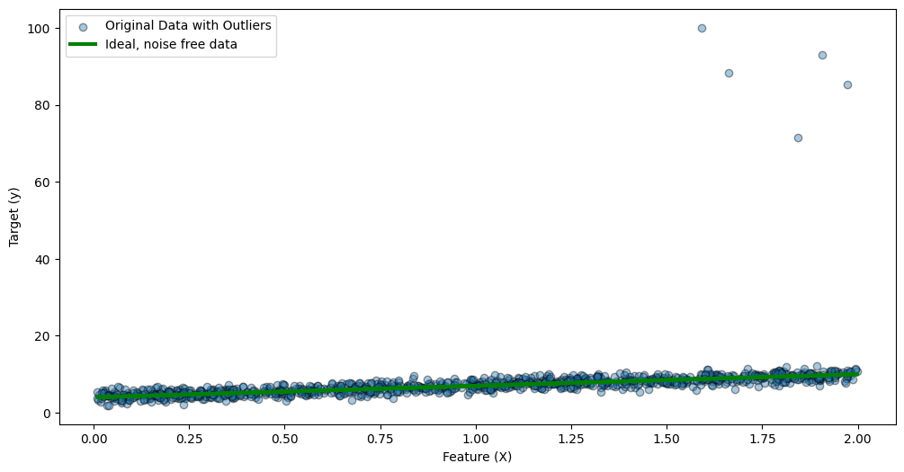
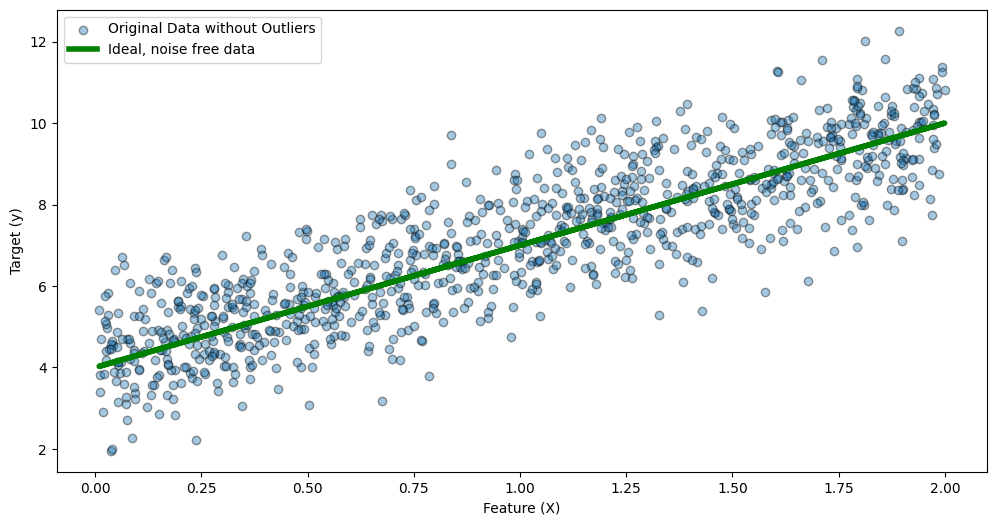
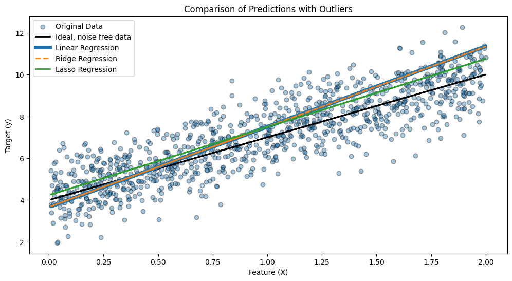
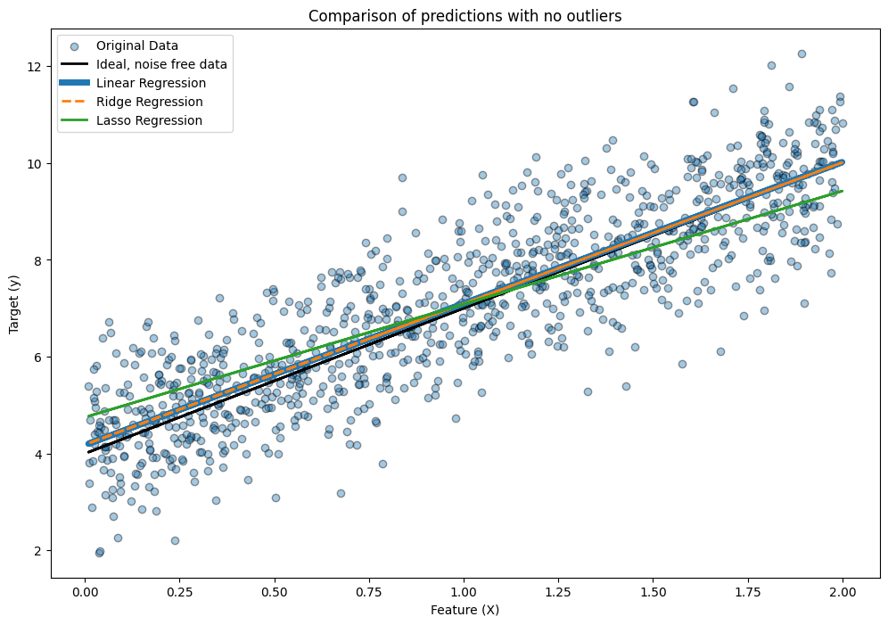
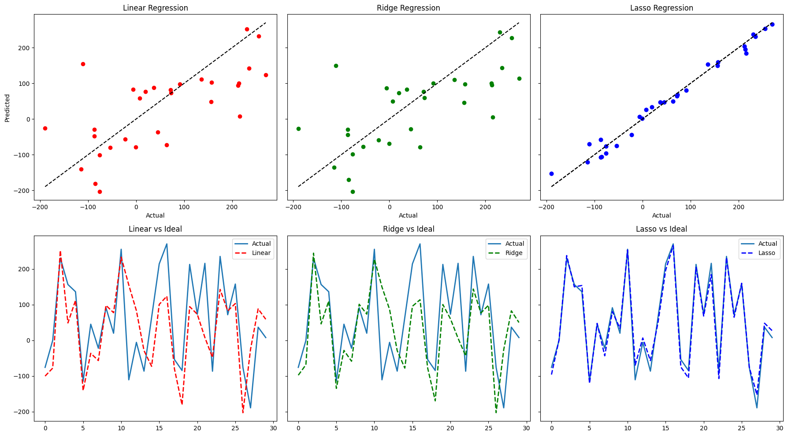
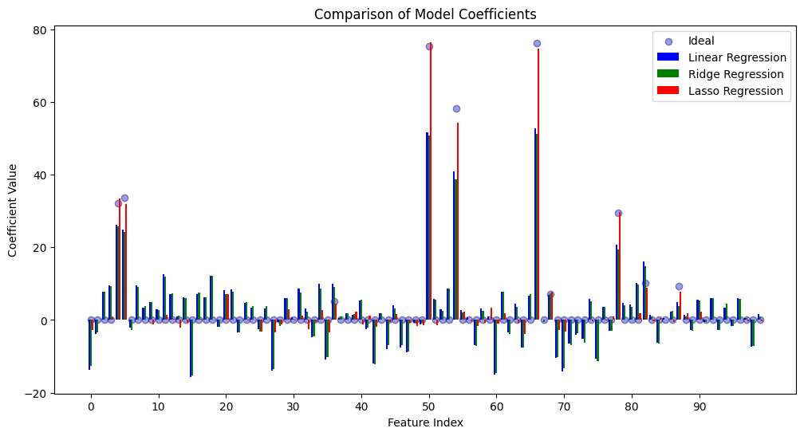
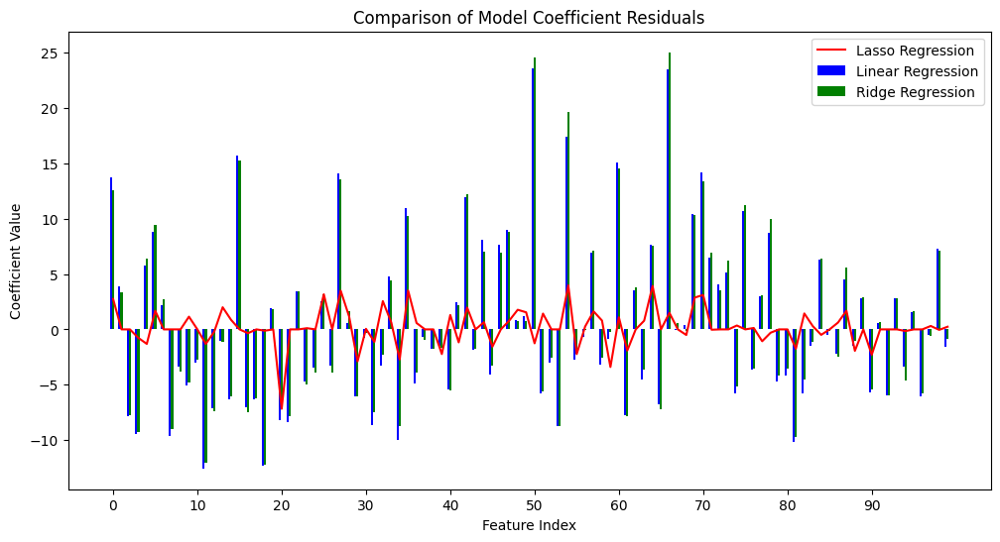
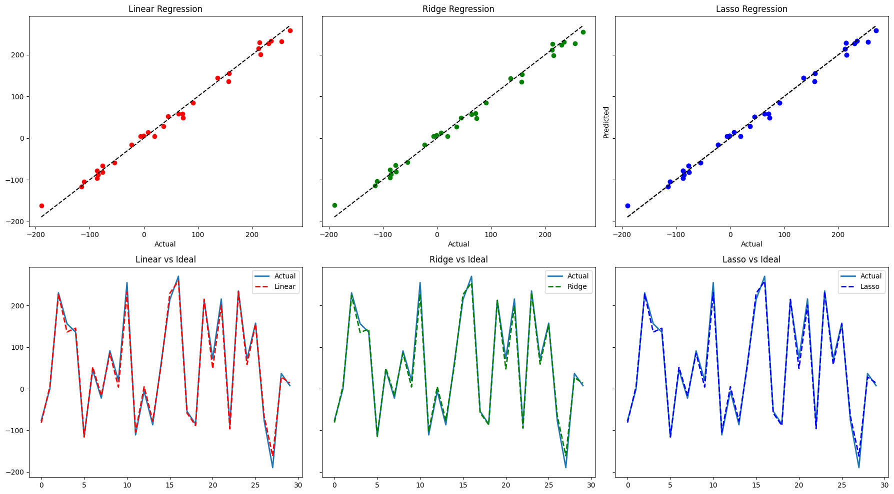

# Regularization in Linear Regression

This project studies how regularization changes linear regression behavior in two settings:

1. **Simple linear regression with injected outliers**
2. **Multiple linear regression with many features, including feature selection with Lasso**

The notebook compares **Ordinary Linear Regression**, **Ridge Regression**, and **Lasso Regression**, then uses **Lasso coefficients** to select important features and retrain the models on the reduced feature set.

---

## Project goal

The main goals are:

- compare ordinary linear regression, Ridge, and Lasso
- see how outliers affect fitted lines
- see how regularization affects coefficient estimates
- use Lasso as a feature selector
- compare model performance before and after feature selection

---

## Libraries used

- `numpy`
- `pandas`
- `matplotlib`
- `scikit-learn`

Main sklearn tools used:

- `LinearRegression`
- `Ridge`
- `Lasso`
- `train_test_split`
- regression metrics:
  - explained variance
  - MAE
  - MSE
  - RMSE
  - R^2

---

## A function for showing evaluation metrics

The notebook defines a helper function that prints standard regression metrics for each model:

- explained variance
- R^2
- MAE
- MSE
- RMSE

These are used throughout the notebook to compare ordinary linear regression, Ridge, and Lasso in a consistent way.

Plain formulas:

- MAE = (1/n) * sum |y_i - yhat_i|
- MSE = (1/n) * sum (y_i - yhat_i)^2
- RMSE = sqrt(MSE)
- R^2 = 1 - (sum (y_i - yhat_i)^2) / (sum (y_i - ybar)^2)

where:

- `y_i` is the true target
- `yhat_i` is the prediction
- `ybar` is the mean of the true targets
- `n` is the number of samples

---

## Part 1: Simple linear regression with outliers

The first part of the notebook creates synthetic data with one feature using a linear relationship of the form:

`y = 4 + 3x + noise`

and also defines the noise-free ideal line:

`y_ideal = 4 + 3x`

Then a small number of large outliers are injected into points with larger `x` values. This makes it possible to compare how sensitive each regression method is to unusual observations.

### Data generation

The notebook:

- generates 1000 samples
- uses one predictor
- adds Gaussian noise
- creates a clean ideal target
- injects 5 artificial outliers into selected points above a threshold

This gives two target versions:

- `y`: original noisy data without injected outliers
- `y_outlier`: same data after adding artificial outliers

### Original data plots

#### Original data with outliers



#### Original data without outliers



These two plots show the baseline data and make the outlier effect visually clear.

---

## Fit Ordinary, Ridge, and Lasso regression models then predicting on outliers.

Three models are fit on the one-feature dataset with outliers:

- **Ordinary Linear Regression**
- **Ridge Regression**
- **Lasso Regression**

Their prediction functions are:

- Ordinary linear regression: `yhat = b0 + b1 x`
- Ridge: minimize  
  `sum (y_i - yhat_i)^2 + alpha * sum w_j^2`
- Lasso: minimize  
  `sum (y_i - yhat_i)^2 + alpha * sum |w_j|`

For one feature, the regularization still affects the fitted slope and intercept indirectly by penalizing coefficient size.

Ridge uses an L2 penalty, so it shrinks coefficients smoothly.  
Lasso uses an L1 penalty, so it can shrink more aggressively and, in higher dimensions, can even force coefficients to zero.

### Plotting data and predictions



We can see that ordinary linear and ridge regression performed similarly, while Lasso outperformed both.  
<br>  
Although the intercept is off for the Lasso fit line, it's slope is much closer to the ideal than the other fit lines.  
<br>  
All three lines were 'pulled up' by the outliers (not plotted here - compare to the plot above where the outliers are shown), with Lasso dampening that effect.

### Same comparison without outliers



When the outliers are removed, all three models are much closer to one another, which shows that the first comparison is really about robustness to abnormal points rather than just raw fitting ability.

---

## Multiple regression regularization and lasso feature selection

Here I compare performances of the three linear regression methods and then use the Lasso result to select important features to use in another model.<br>

Note that:
- Simple linear regression: one predictor  
`y = b0 + b1 x1`
- Multiple linear regression: two or more predictors  
`y = b0 + b1 x1 + b2 x2 + ... + bk xk`

### Creating synthetic regression data:

`n_samples=100` → create 100 data points

`n_features=100` → each point has 100 input features

`n_informative=10` → only 10 of those 100 features actually matter

`noise=10` → add random noise to the target values

`random_state=42` → makes the result reproducible

`coef=True` → also return the true underlying coefficients

The data is built roughly like this, suitable for regression:

`y = b + w1*x1 + w2*x2 + ... + wk*xk + noise`

This setup is useful because the notebook knows the true underlying coefficient vector `ideal_coef`, so the fitted coefficients from each model can be compared directly against the ground truth.

---

## Multiple-regression model comparison

The notebook splits the data into training and testing sets, then fits:

- `LinearRegression()`
- `Ridge(alpha=1.0)`
- `Lasso(alpha=0.1)`

on the full 100-feature dataset.

### Prediction vs actual plots



The results for ordinary and ridge regession are poor.<br>
Explained variances are under 50%, and R^2 is very low.<br>
However, the result for Lasso is stellar.

This figure shows that the Lasso predictions align much more closely with the diagonal reference line, meaning its predicted values are much closer to the actual targets.

---

## Model coefficients

The notebook next compares estimated coefficients to the true coefficients used to generate the data.



This is one of the most important parts of the project. Since only 10 of the 100 features are truly informative, a good model should identify the important coefficients and avoid assigning large weights to irrelevant features.

Ridge usually shrinks coefficients but keeps many of them nonzero.  
Lasso tends to produce a sparser solution, which is why it is especially useful for feature selection.

### Coefficient residuals



We can see from the first plot how much closer the Lasso coefficients are to the ideal coefficients than for the other two models. An easier way to visualize the difference is to look at the residual errors, as in the second plot. Clearly the Lasso coefficient residuals are much closer to zero than the others.

In plain terms, the residual for a coefficient is:

`coefficient residual = estimated coefficient - ideal coefficient`

Smaller residuals mean the model recovered the true structure of the data more accurately.

---

## Using Lasso to select most important features

### Part A: Choosing a threshold value to select features based on the Lasso coefficients

What I do in below codes:

1. **Fit a Lasso model**
   - Lasso gives a coefficient for each feature.

2. **Pick a cutoff**
   - if a Lasso coefficient is big enough in absolute value, treat that feature as **important**
   - if it is very close to 0, treat it as **not important**

3. **Make a table**
   - for each feature, show:
     - the Lasso coefficient
     - the true/ideal coefficient
     - whether Lasso selected it as important (`True/False`)

4. **Show two smaller tables**
   - one with only the features Lasso selected
   - one with only the features that are truly important in the generated data

5. **Compare them**
   - see whether Lasso found the truly important features correctly

So:

Use Lasso to guess which features matter, then compare its guess with the real answer.

The notebook uses:

`threshold = 5`

and selects features satisfying:

`|lasso coefficient| > threshold`

This produces a reduced feature set consisting only of features considered important by Lasso.

---

## Using the threshold to select the most important features for use in modelling

### Part B: splitting data

After selecting the important feature indices, the notebook filters the original feature matrix and creates a smaller dataset:

- original shape: 100 features
- filtered shape: only the selected important features

Then it performs a new train/test split on this reduced feature set.

### Part C: fit and apply models to those features

The same three models are retrained on the filtered data:

- Ordinary Linear Regression
- Ridge Regression
- Lasso Regression

This tests whether Lasso can help not only as a final predictive model, but also as a preprocessing and feature selection tool for other regression models.

### Final comparison after feature selection



The new results are improved for ordinary and Ridge regression, and slightly improved for Lasso, supporting the idea that Lasso regression can be very beneficial when used as a feature selector.

---

## Technical summary of the code

The notebook is organized in a simple pipeline:

1. install and import required libraries
2. define a reusable regression evaluation function
3. generate synthetic one-feature data
4. inject outliers
5. fit and compare ordinary, Ridge, and Lasso on the one-feature problem
6. generate synthetic multi-feature regression data with known true coefficients
7. split into train and test sets
8. fit the three models on the full feature set
9. compare predictions and coefficients
10. use Lasso coefficients to identify important features
11. reduce the feature matrix to selected features
12. retrain the models on the reduced feature set
13. compare performance again

This structure makes the notebook easy to follow and shows both the predictive and interpretability side of regularization.

---

## Figure analysis

- `original-with-outlier.png` shows that only a few large outliers can visually distort the apparent trend.
- `original-without-outlier.png` gives the clean baseline and makes the true linear structure easier to see.
- `compare-predictions-with-outlier.png` shows that Lasso is less pulled by outliers than ordinary linear regression and Ridge in this setup.
- `compare-predictions-without-outlier.png` shows that when outliers are removed, the fitted lines become much more similar.
- `multiple-regression-predictionVSactual.png` shows that Lasso performs much better than ordinary linear regression and Ridge on the high-dimensional synthetic dataset.
- `model-coefficients.png` shows that Lasso estimates are much closer to the true sparse coefficient pattern.
- `model-coefficients-residuals.png` confirms that Lasso has smaller coefficient errors.
- `last-plot-comparision.png` shows that using Lasso-selected features improves the reduced-model pipeline, especially for ordinary and Ridge regression.

Overall, the project demonstrates two core ideas:

1. regularization can reduce sensitivity to noisy or extreme observations
2. Lasso is especially useful when many features are irrelevant because it can act as both a predictor and a feature selector

---

## File structure

Make sure your repository contains the notebook and image files with these exact names in the same directory as `README.md`:

- `regularization-in-linear-regression.ipynb`
- `original-with-outlier.png`
- `original-without-outlier.png`
- `compare-predictions-with-outlier.png`
- `compare-predictions-without-outlier.png`
- `multiple-regression-predictionVSactual.png`
- `model-coefficients.png`
- `model-coefficients-residuals.png`
- `last-plot-comparision.png`

If the filenames stay exactly the same, the images will render correctly on GitHub after commit and push.

---

## How to run

1. open the notebook
2. install the required packages
3. run cells in order
4. generate the figures
5. keep the generated image files in the repo beside the README

---

## Conclusion

This notebook compares ordinary linear regression, Ridge regression, and Lasso regression in two controlled experiments.

In the one-feature case with injected outliers, Lasso appears less affected by the extreme points and stays closer to the ideal trend.

In the multi-feature case, Lasso strongly outperforms the other models because the data is sparse: only a small subset of features truly matters. Its coefficient estimates are closer to the true coefficients, and it can also be used to select a smaller feature subset that improves later modeling.

So the main lesson is not just that regularization helps, but that different regularizers help in different ways:

- Ridge helps by shrinking coefficients
- Lasso helps by shrinking and selecting
- ordinary linear regression has no penalty and is therefore more vulnerable in these settings
```
